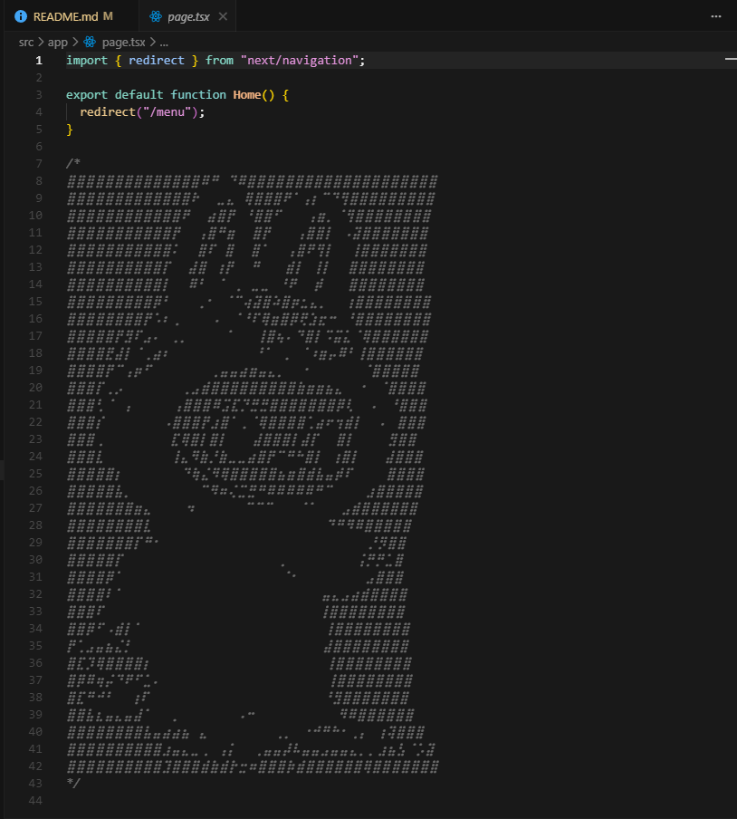

# Hotel Management & Food Ordering System

A comprehensive Next.js application that combines hotel room management with a food ordering system. This project provides a complete solution for hotel guests to order food and for administrators to manage both hotel operations and food orders.

## 🚀 Tech Stack

- **Framework**: Next.js 15.5.2 with App Router
- **Language**: TypeScript
- **Styling**: Tailwind CSS 4
- **UI Components**: HeroUI (NextUI)
- **State Management**: React Context API
- **Authentication**: JWT with bcrypt
- **Charts**: Recharts
- **QR Code**: qrcode & qrcode.react
- **HTTP Client**: Axios
- **Validation**: Zod
- **Animation**: Framer Motion

## 📁 Project Structure

```
src/
├── app/                          # Next.js App Router
│   ├── api/                      # API Routes
│   │   ├── auth/                 # Authentication endpoints
│   │   │   ├── login/            # User login
│   │   │   └── register/         # User registration
│   │   ├── protected/            # Protected API routes
│   │   │   ├── hotel/            # Hotel management APIs
│   │   │   │   ├── reserve/      # Room reservation
│   │   │   │   ├── checkin/      # Check-in process
│   │   │   │   ├── checkout/     # Check-out process
│   │   │   │   └── rooms/        # Room management
│   │   │   └── orders/           # Order management APIs
│   │   │       ├── route.ts      # Create/get orders
│   │   │       └── status/       # Update order status
│   │   └── proxy/                # API proxy for backend communication
│   ├── dashboard/                # Admin dashboard
│   │   ├── page.tsx              # Main dashboard
│   │   └── activity/             # Activity management
│   ├── hotel/                    # Hotel management pages
│   ├── menu/                     # Food menu pages
│   │   └── [slug]/               # Individual menu item details
│   ├── login/                    # Authentication pages
│   │   ├── page.tsx              # Login form
│   │   ├── external/             # External login
│   │   └── qrcode/               # QR code login
│   ├── orders/                   # Order management
│   ├── pay/                      # Payment processing
│   └── layout.tsx                # Root layout
├── components/                   # Reusable components
│   ├── auth/                     # Authentication components
│   ├── dashboard/                # Dashboard-specific components
│   │   ├── BookingAnalytics.tsx  # Booking analytics charts
│   │   ├── BookingList.tsx       # Booking list display
│   │   ├── HotelRoomManagement.tsx # Room management
│   │   ├── OrderManagement.tsx   # Order management
│   │   ├── OrderOverview.tsx     # Order overview
│   │   ├── IncomeAnalytics.tsx   # Income analytics
│   │   ├── PopularMenuAnalytics.tsx # Menu popularity analytics
│   │   ├── QRCodeModal.tsx       # QR code display modal
│   │   ├── ReservationModal.tsx  # Reservation creation modal
│   │   └── RoomCard.tsx          # Individual room card
│   ├── hotel/                    # Hotel-specific components
│   ├── menu/                     # Menu-specific components
│   │   ├── menuList.tsx          # Menu listing
│   │   ├── menuDetail.tsx        # Menu item details
│   │   └── AddToCartModal.tsx    # Add to cart modal
│   ├── Navbar.tsx                # Navigation component
│   └── SessionProvider.tsx       # Session management
├── contexts/                     # React Context providers
│   └── CartContext.tsx           # Shopping cart context
├── data/                         # Static data
│   ├── food_categories.ts        # Food category definitions
│   └── food_allergens.ts         # Allergen information
├── hooks/                        # Custom React hooks
├── lib/                          # Utility libraries
│   ├── axios.ts                  # HTTP client configuration
│   ├── cart-utils.ts             # Cart utility functions
│   └── qrcode-utils.ts           # QR code generation utilities
├── middleware.ts                 # Next.js middleware for auth
├── server/                       # Server-side utilities
├── services/                     # Business logic services
└── types/                        # TypeScript type definitions
    ├── cart.ts                   # Cart-related types
    ├── menu.ts                   # Menu item types
    ├── order.ts                  # Order types
    ├── room.ts                   # Room types
    └── user.ts                   # User types
```

## 🎯 Core Features

### 🏨 Hotel Management
- **Room Reservation System**: Complete room booking workflow with guest information
- **Check-in/Check-out Process**: Streamlined guest management
- **QR Code Integration**: Generate QR codes for room access and auto-login
- **Room Status Management**: Real-time room availability tracking
- **Guest Analytics**: Booking statistics and revenue tracking

### 🍽️ Food Ordering System
- **Interactive Menu**: Browse food items with detailed information
- **Advanced Filtering**: Filter by category, price range, spice level, and allergens
- **Shopping Cart**: Add items with custom notes and quantity management
- **Order Management**: Real-time order tracking and status updates
- **Payment Processing**: Multiple payment methods (Card, PromptPay, LinePay)

### 👤 User Management
- **Role-based Access**: Admin and guest user roles
- **JWT Authentication**: Secure token-based authentication
- **Account Management**: User registration and profile management
- **Session Management**: Persistent login sessions

### 📊 Analytics Dashboard
- **Order Analytics**: Track order volume, revenue, and trends
- **Popular Menu Items**: Identify best-selling food items
- **Income Tracking**: Revenue analytics with charts and graphs
- **Booking Statistics**: Hotel occupancy and booking patterns

### 🔐 Security Features
- **Protected Routes**: Middleware-based route protection
- **JWT Token Validation**: Secure API access
- **Password Hashing**: bcrypt for secure password storage
- **Account Expiration**: Time-based account management

## 🚀 Getting Started

### Prerequisites
- Node.js 18+ 
- npm, yarn, pnpm, or bun

### Installation

1. **Clone the repository**
   ```bash
   git clone <repository-url>
   cd frontend-2-founder-old
   ```

2. **Install dependencies**
   ```bash
   npm install
   # or
   yarn install
   # or
   pnpm install
   # or
   bun install
   ```

3. **Set up environment variables**
   Create a `.env.local` file in the root directory:
   ```env
   NEXT_PUBLIC_API_URL=http://localhost:8000
   NEXT_PUBLIC_JWT_SECRET=your-super-secret-key
   ```

4. **Run the development server**
   ```bash
   npm run dev
   # or
   yarn dev
   # or
   pnpm dev
   # or
   bun dev
   ```

5. **Open your browser**
   Navigate to [http://localhost:3000](http://localhost:3000)

## 🛠️ Available Scripts

- `npm run dev` - Start development server with Turbopack
- `npm run build` - Build for production with Turbopack
- `npm run start` - Start production server
- `npm run preview` - Build and preview production build
- `npm run lint` - Run ESLint
- `npm run lint:fix` - Fix ESLint errors
- `npm run format` - Format code with Prettier

## 🏗️ Architecture

### Frontend Architecture
- **Next.js App Router**: Modern routing with server and client components
- **Component-based Design**: Modular, reusable React components
- **Context API**: Global state management for cart and session
- **TypeScript**: Full type safety throughout the application

### API Architecture
- **RESTful APIs**: Standard HTTP methods for CRUD operations
- **JWT Authentication**: Secure token-based authentication
- **Proxy Pattern**: Centralized API communication through proxy routes
- **Error Handling**: Comprehensive error handling and user feedback

### Database Integration
- **Backend API**: Communicates with external backend service
- **Data Validation**: Zod schemas for request/response validation
- **Type Safety**: TypeScript interfaces for all data models

## 🔧 Configuration

### Environment Variables
- `NEXT_PUBLIC_API_URL`: Backend API base URL
- `NEXT_PUBLIC_JWT_SECRET`: JWT signing secret

### Tailwind CSS
The project uses Tailwind CSS 4 with custom configurations for styling.

### ESLint & Prettier
Configured for code quality and consistent formatting.

## 📱 Features Overview

### For Guests
- Browse and search food menu
- Add items to cart with custom notes
- Place orders with multiple payment options
- View order history and status
- Access hotel information and amenities

### For Administrators
- Manage hotel room reservations
- Process check-ins and check-outs
- Track and update food orders
- View comprehensive analytics
- Generate QR codes for room access
- Monitor revenue and popular items

## 🚀 Deployment

The application is optimized for deployment on Vercel but can be deployed on any platform that supports Next.js.

### Vercel Deployment
1. Connect your repository to Vercel
2. Set environment variables
3. Deploy automatically on push to main branch

## 📄 License

This project is licensed under the MIT License - see the LICENSE file for details.

---

Built with ❤️ using Next.js, TypeScript, and modern web technologies.

also with labubu :)
